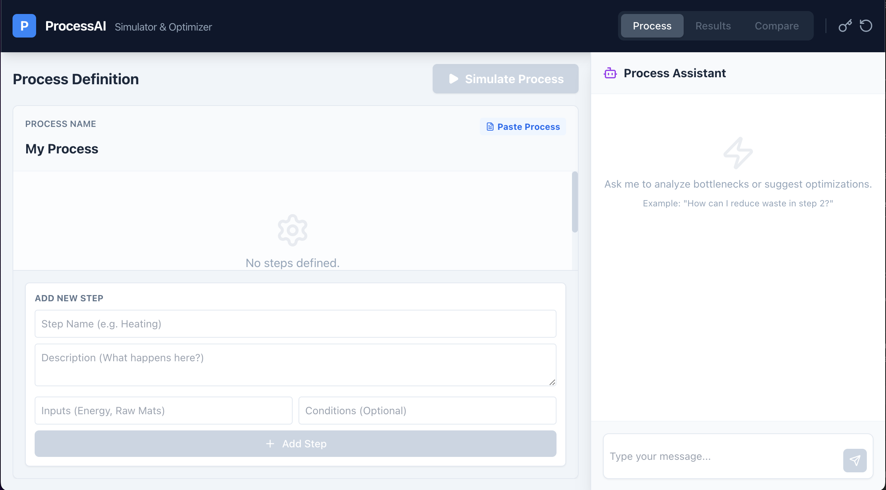
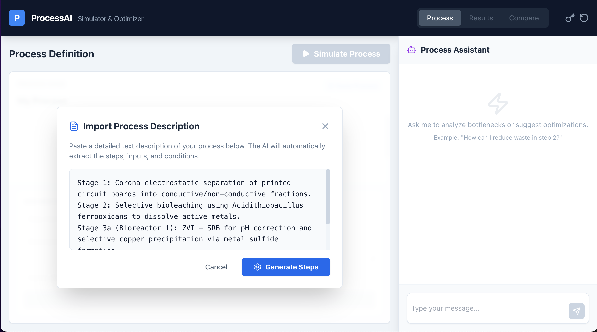
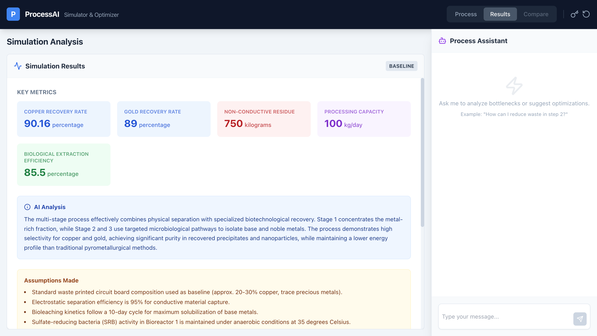
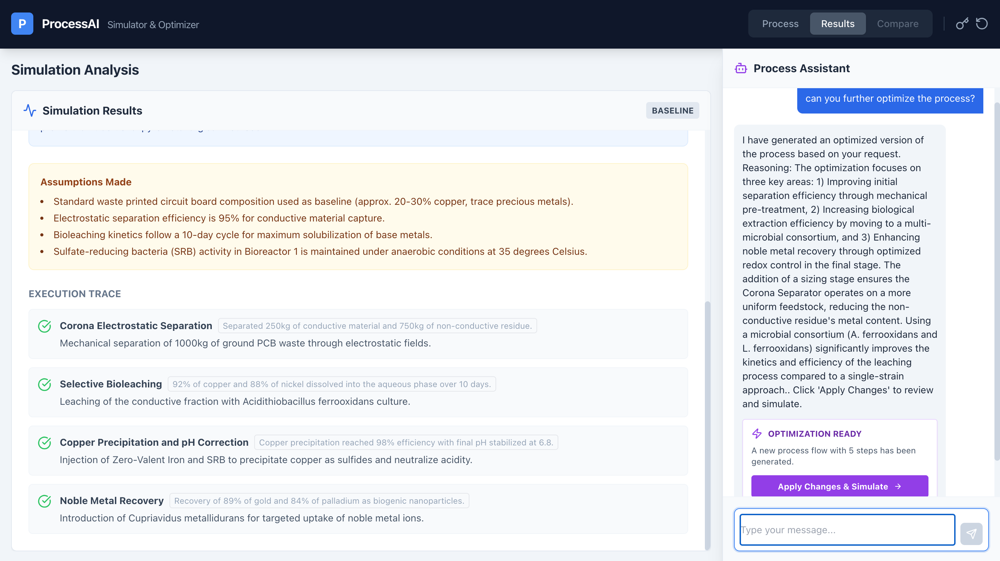
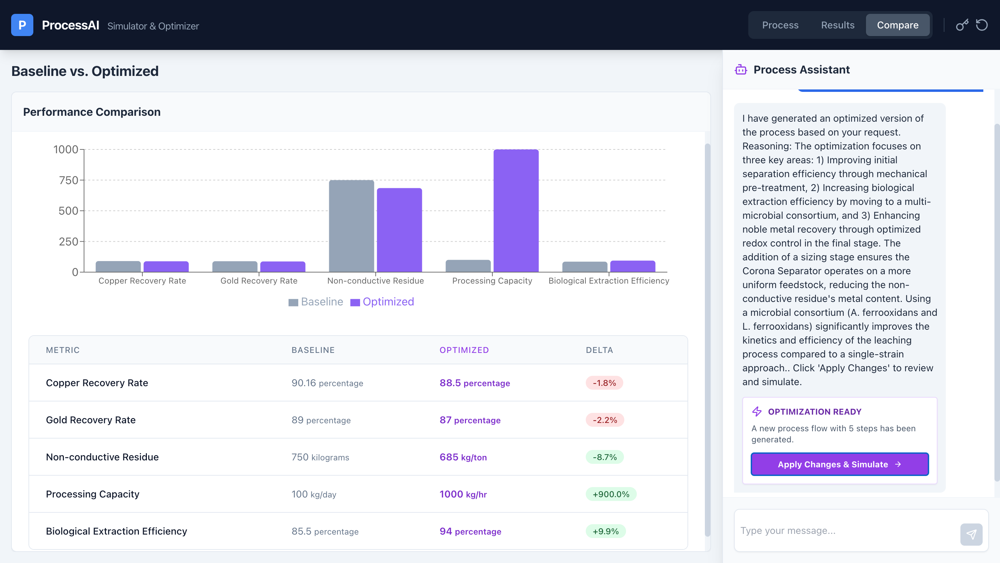
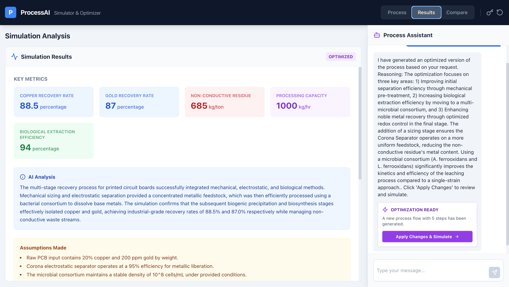

# ProcessAI - Workflow Simulator & Optimizer

<div align="center">
  


**An intelligent workflow simulation and optimization platform powered by AI**

[Live Demo](https://process-ai-ruddy.vercel.app) • [Report Bug](../../issues) • [Request Feature](../../issues)

</div>

---

## 📋 Table of Contents

- [About The Project](#about-the-project)
- [Features](#features)
- [Screenshots](#screenshots)
- [Tech Stack](#tech-stack)
- [Prerequisites](#prerequisites)
- [Installation & Setup](#installation--setup)
- [Running the Application](#running-the-application)
- [Building for Production](#building-for-production)
- [Project Structure](#project-structure)
- [Usage Guide](#usage-guide)
- [Environment Variables](#environment-variables)
- [Deployment](#deployment)
- [Contributing](#contributing)
- [License](#license)

---

## 🎯 About The Project

**ProcessAI** is an intelligent workflow simulation and optimization tool that leverages AI to help businesses analyze, simulate, and optimize their processes. Whether you're designing new workflows or improving existing ones, ProcessAI provides powerful insights through AI-driven simulations and comparisons.

This application enables users to:
- Design custom business processes visually
- Simulate process execution with AI insights
- Compare baseline vs optimized workflows
- Get AI-powered recommendations through a chat interface
- Analyze performance metrics and bottlenecks

---

## ✨ Features

- **🏗️ Visual Process Builder**: Drag-and-drop interface to create process workflows
- **🤖 AI-Powered Simulation**: Uses Google Gemini API for intelligent process simulation
- **📊 Comparison Analysis**: Compare baseline and optimized processes side-by-side
- **💬 AI Chat Assistant**: Get real-time recommendations and insights
- **📈 Advanced Visualization**: Charts and metrics for process analysis
- **💾 Local Storage**: Automatically saves your work to browser storage
- **🔐 Secure API Key Management**: Modal-based API key handling
- **⚡ Real-time Updates**: Instant feedback on process modifications

---

## 📸 Screenshots

### Process Builder


### Simulation Results


### Comparison View


### Chat Assistant


### Performance Metrics


---

## 🛠️ Tech Stack

**Frontend:**
- **React 19.2.4** - Modern UI library
- **TypeScript** - Type-safe JavaScript
- **Vite** - Lightning-fast build tool
- **Tailwind CSS** - Styling framework
- **Recharts** - Data visualization library
- **Lucide React** - Icon library

**Backend/AI:**
- **Google Generative AI (@google/genai)** - AI-powered simulations

**Development Tools:**
- **Node.js** - JavaScript runtime
- **npm** - Package manager

---

## 📋 Prerequisites

Before you begin, ensure you have the following installed:

- **Node.js** (version 16.x or higher) - [Download](https://nodejs.org/)
- **npm** (usually comes with Node.js)
- **Git** - [Download](https://git-scm.com/)
- **Google Gemini API Key** - [Get one here](https://aistudio.google.com/apikey)

### Verify Installation

```bash
node --version
npm --version
```

---

## 🚀 Installation & Setup

### 1. Clone the Repository

```bash
git clone <repository-url>
cd processai---simulator-&-optimizer
```

### 2. Install Dependencies

```bash
npm install
```

This will install all required packages including:
- React and React DOM
- Google Generative AI
- Recharts for visualizations
- Lucide icons
- TypeScript
- Vite

### 3. Configure Environment Variables

Create a `.env.local` file in the root directory:

```bash
cp .env.local.example .env.local  # if example exists, or create manually
```

Edit `.env.local` and add your Gemini API key:

```env
VITE_GEMINI_API_KEY=your_api_key_here
```

Or you can set it directly in the application via the API Key Modal when running.

---

## 💻 Running the Application

### Development Mode

Start the development server with hot-reload:

```bash
npm run dev
```

The application will be available at:
```
http://localhost:5173
```

**Features in dev mode:**
- Hot Module Replacement (HMR) for instant updates
- Source maps for debugging
- React Fast Refresh

### Preview Production Build

Build and preview the production version locally:

```bash
npm run build
npm run preview
```

---

## 🏗️ Building for Production

Create an optimized production build:

```bash
npm run build
```

This generates a `dist/` folder containing:
- Minified and optimized JavaScript
- Optimized CSS bundles
- Static assets
- Ready for deployment

**Build output will be in:**
```
./dist/
```

---

## 📁 Project Structure

```
processai---simulator-&-optimizer/
├── src/
│   ├── components/
│   │   ├── ProcessBuilder.tsx       # Process creation interface
│   │   ├── SimulationViewer.tsx     # Results visualization
│   │   ├── ComparisonView.tsx       # Side-by-side comparison
│   │   ├── ChatPanel.tsx            # AI chat interface
│   │   └── ApiKeyModal.tsx          # API key management
│   ├── services/
│   │   └── geminiService.ts         # Google Gemini API integration
│   ├── App.tsx                      # Main application component
│   ├── index.tsx                    # React entry point
│   ├── types.ts                     # TypeScript type definitions
│   └── index.html                   # HTML template
├── Images/                          # Screenshots for documentation
├── public/                          # Static assets
├── .env.local                       # Environment variables (not in repo)
├── package.json                     # Project dependencies
├── tsconfig.json                    # TypeScript configuration
├── vite.config.ts                   # Vite configuration
└── README.md                        # This file
```

---

## 📖 Usage Guide

### 1. **Setting Up Your API Key**

- Click the **🔑 Key** button in the top-right corner
- Enter your Google Gemini API key
- The key is stored securely in your browser's local storage

### 2. **Building a Process**

1. Go to the **Build** tab
2. Enter a process name (e.g., "Customer Service Workflow")
3. Click **"Add Step"** to create process steps
4. For each step, specify:
   - Step name
   - Description
   - Expected duration
   - Resource requirements

### 3. **Running Simulations**

1. Click the **▶ Play** button to simulate your process
2. The AI analyzes your process using Gemini API
3. View results including:
   - Total process time
   - Resource utilization
   - Potential bottlenecks
   - Performance metrics

### 4. **Comparing Processes**

1. Get baseline results from the initial simulation
2. Optimize your process with AI suggestions
3. Click **Compare** to see side-by-side metrics
4. Analyze improvements in efficiency

### 5. **Getting AI Recommendations**

- Use the **Chat Panel** to ask questions about your process
- Get AI-powered suggestions for optimization
- Discuss potential improvements

---

## 🔧 Environment Variables

Create a `.env.local` file with the following variables:

```env
# Required: Google Gemini API Key
VITE_GEMINI_API_KEY=your_gemini_api_key_here

# Optional: API endpoint (if using custom backend)
VITE_API_URL=https://api.example.com
```

**Note:** Variables must be prefixed with `VITE_` to be accessible in the frontend.

---

## 🌐 Deployment

### Deploy to Vercel (Recommended)

This project is configured for easy deployment on Vercel:

```bash
npm install -g vercel
vercel
```

Follow the prompts and your app will be live at: `process-ai-ruddy.vercel.app`

### Deploy to Netlify

1. Connect your GitHub repository to Netlify
2. Set build command: `npm run build`
3. Set publish directory: `dist`
4. Add environment variables in Netlify dashboard
5. Deploy!

### Deploy to Other Platforms

**GitHub Pages:**
```bash
npm run build
# Push the dist folder to gh-pages branch
```

**Docker:**
```bash
docker build -t processai .
docker run -p 3000:3000 processai
```

### Environment Variables for Production

Ensure these are set in your deployment platform:

| Variable | Value |
|----------|-------|
| `VITE_GEMINI_API_KEY` | Your Gemini API key |

---

## 🔗 Live Demo

**Access the live application:**
https://process-ai-ruddy.vercel.app

---

## 🐛 Troubleshooting

### Issue: "API Key not found"
- **Solution:** Click the Key button and enter your Gemini API key

### Issue: "Port 5173 already in use"
- **Solution:** Change the port in vite.config.ts or kill the process using that port

### Issue: Dependencies not installing
```bash
rm -rf node_modules package-lock.json
npm install
```

### Issue: Build fails
```bash
npm run build -- --verbose
```

---

## 📚 Additional Resources

- [React Documentation](https://react.dev)
- [Vite Documentation](https://vitejs.dev)
- [Google Gemini API](https://ai.google.dev)
- [TypeScript Handbook](https://www.typescriptlang.org/docs/)
- [Recharts Documentation](https://recharts.org)

---

## 📝 License

This project is open source and available under the MIT License.

---

## 💡 Contributing

Contributions are welcome! To contribute:

1. Fork the repository
2. Create a feature branch (`git checkout -b feature/AmazingFeature`)
3. Commit your changes (`git commit -m 'Add some AmazingFeature'`)
4. Push to the branch (`git push origin feature/AmazingFeature`)
5. Open a Pull Request

<div align="center">
  
**Made with ❤️ using React, TypeScript, and AI**

[⬆ Back to Top](#processai---workflow-simulator--optimizer)

</div>
